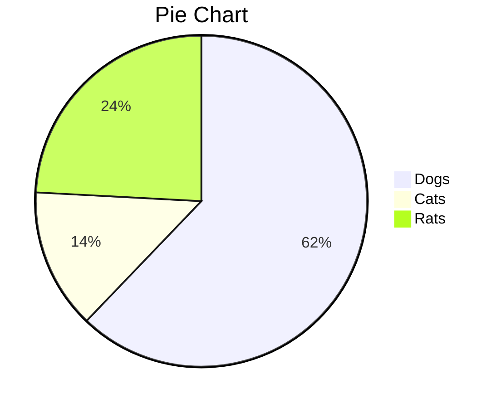
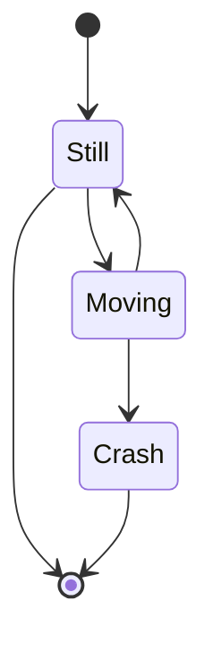
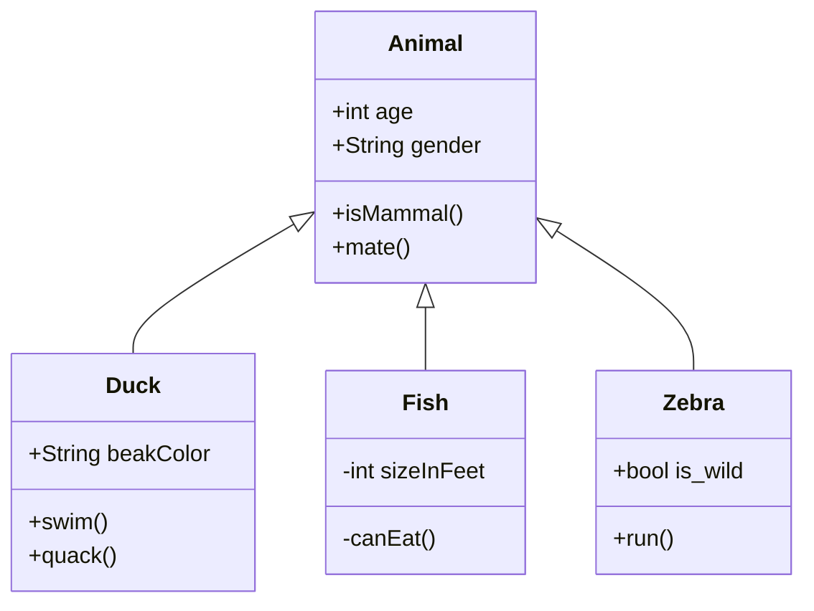

# Markup Language #

### javascript ###

```javascript
console.log("windows");
```

```go
func testing(test1, test2 int) {
  log.Printf("nothing to complain")
}
```

* This is point one
  * This is 1.1
* Point 2

1. point 1


- [ ] Task 1
- [ ] Task 2
- [ ] Task 3: Correct it


```bash
ls -latr
ps aux | grep java
```


| Top         | Name       | User             |
| ----------- | ---------- | ---------------- |
| How are you | George Liu | vrcats@gmail.com |
|             |            |                  |
|             |            |                  |

A [link](www.vrcats.com) to my website.


```sequence
Note right of Server: fully started

Server->Client: hello
Client-->Server: yes, i am alive
Server->Peer: did you get my response?
Peer-->Client: pass this message to server:
Peer-->Client: yes i got the message
Client->Server: peer says he got your message

```


```flow
st=>start: Start
op=>operation: Your Operation
cond=>condition: Yes or No?
e=>end

st->op->cond
cond(yes)->e
cond(no)->op
```







